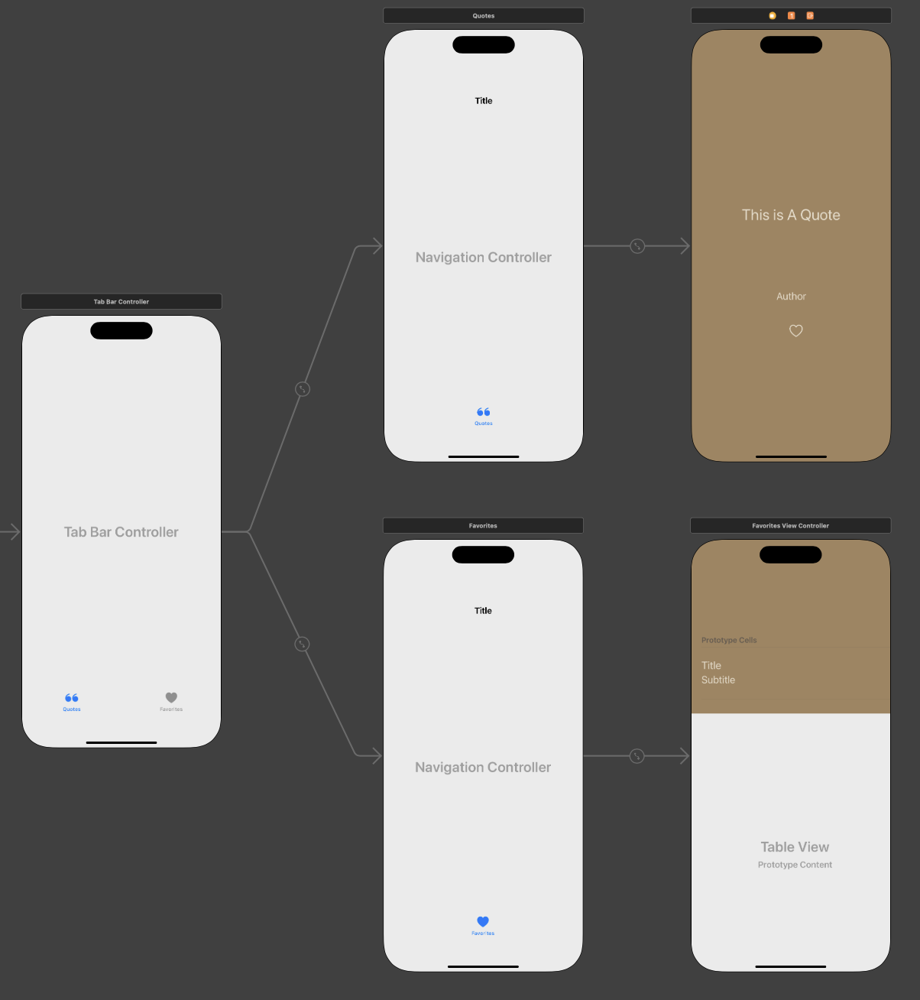

# Quote of the Day

## Table of Contents

1. [Overview](#Overview)
2. [Product Spec](#Product-Spec)
3. [Wireframes](#Wireframes)
4. [Schema](#Schema)

## Overview

### Description

Quote of the Day is an iOS app that delivers exactly one fresh, inspirational or thought-provoking quote each day at noon (EST), ensuring users receive a moment of daily reflection. All quotes are saved locally in UserDefaults (cached), providing lightning-fast load times and offline access that persists seamlessly across app launches. Additionally, users can tap the heart icon to favorite any quote, building a personalized collection that’s neatly organized in the Favorites tab for users to easily revisit.

### App Evaluation

[Evaluation of your app across the following attributes]
- **Category:** Lifestyle

- **Mobile:** This is a mobile first application built to be easy to use for anyone. User's are given one quote a day, and they have the option to favorite them.

- **Story:** Quotes are very important for self refelction and inner growth. Sometimes, just reading the right quote at right time can dramamtically transcend one's life for the better.

- **Market:** For those curious to think and learn deeply about one's self or the world around them.

- **Habit:** Daily quotes keep users engaged with the app. Furthermore, the app was built to value users time; so users see first what they came for, maintaining user satisfaction.

- **Scope:** The app is near complete for presentation, all major functionalities have been implemnted successfully. Future updates may be implemented to increase capabilities.

## Product Spec

### 1. User Stories (Required and Optional)

**Required Must-have Stories**

* User loads app
* User is fetched a quote for the day
* User can see the author of the fetched quote
* User can favorite the quote
* User can visit all their favorited quotes in a seperate tab
* User can remove quotes from their favorites


**Optional Nice-to-have Stories**

* User can request for another quote during the day
* User can share daily quotes, or quotes from their favorites

### 2. Screen Archetypes

- [x] Home Screen
* User is fetched a quote for the day (if opening app for the first time that day) 
* User can see the author of the fetched quote
* User can favorite the quote
- [x] Favorites Screen
* User can visit all their favorited quotes (oldest to latest)
* User can remove quotes from their favorites

### 3. Navigation

**Tab Navigation** (Tab to Screen)

* Quotes Tab
* Favorites Tab

**Flow Navigation** (Screen to Screen)

* Quotes Screen
    - No further navigation
* Favorites Screen
    - No further navigation

## Wireframes

### [BONUS] Digital Wireframes & Mockups


### [BONUS] Interactive Prototype

## Schema

### Models

| Model               | Attributes                                 | Description & Storage                                                                                                                                      |
|---------------------|--------------------------------------------|------------------------------------------------------------------------------------------------------------------------------------------------------------|
| **ZenQuote**        | `q: String`<br>`a: String`                 | Represents a single quote. Conforms to `Codable` so it can be JSON-encoded/decoded for persistence in `UserDefaults` :contentReference[oaicite:0]{index=0}.  |
| **SavedDailyQuote** | `quote: ZenQuote`<br>`timestamp: Date`     | Bundles the day’s quote and the fetch time. Stored under keys `"dailyQuote"` (Data) and `"lastFetchDate"` (Date) in `UserDefaults` :contentReference[oaicite:1]{index=1}. |
| **Favorites**       | `[ZenQuote]`                               | An array of favorited quotes. Stored under key `"favorites"` as JSON-encoded Data in `UserDefaults` :contentReference[oaicite:2]{index=2}.                   |

### Persistence Keys

- **`dailyQuote`**: Holds the JSON-encoded `ZenQuote` for today.  
- **`lastFetchDate`**: Holds the `Date` the quote was last fetched (in EST).  
- **`favorites`**: Holds the JSON-encoded array of all `ZenQuote` objects the user has favorited.  

All three keys live in `UserDefaults.standard`, providing fast, persistent, offline-capable storage for your quotes and metadata :contentReference[oaicite:3]{index=3}.

### Networking

### Network Requests by Screen

- **Quotes Tab**
  - **Fetch Daily Quote**  
    - **Endpoint:** `GET https://zenquotes.io/api/random`  
    - **Description:** Retrieves a single random quote wrapped in a one-element JSON array. Used by `DailyQuoteManager.loadQuote()`.
  - **Manual Refresh (“Get New Quote” button)**
    - **Endpoint:** `GET https://zenquotes.io/api/random`  
    - **Description:** Bypasses the daily cache and always fetches a new random quote when tapped.

- **Favorites Tab**
  - **Network Requests:** _None_  
  - **Notes:** All favorites are loaded from local storage via  
    ```swift
    FavoritesManager.shared.getFavorites()
    ```

### Code Snippets for Network Requests

```swift
// QuoteFetcher.swift
func fetchDailyQuote(completion: @escaping (ZenQuote?, Error?) -> Void) {
    guard let url = URL(string: "https://zenquotes.io/api/random") else {
        completion(nil, NSError(domain: "Invalid URL", code: 0))
        return
    }

    URLSession.shared.dataTask(with: url) { data, response, error in
        if let error = error {
            completion(nil, error)
            return
        }
        guard let data = data else {
            completion(nil, NSError(domain: "No Data", code: 0))
            return
        }
        do {
            let quotes = try JSONDecoder().decode([ZenQuote].self, from: data)
            completion(quotes.first, nil)
        } catch {
            completion(nil, error)
        }
    }
    .resume()
}
```
###  ZenQuotes Endpoints
- GET https://zenquotes.io/api/today
- GET https://zenquotes.io/api/quotes/author/{author-name}
- GET https://zenquotes.io/api/authors